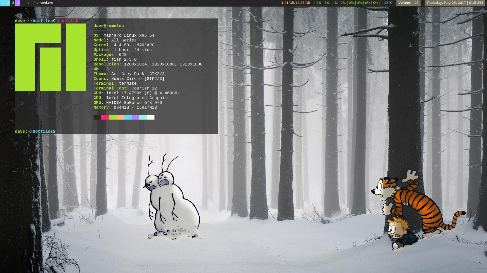
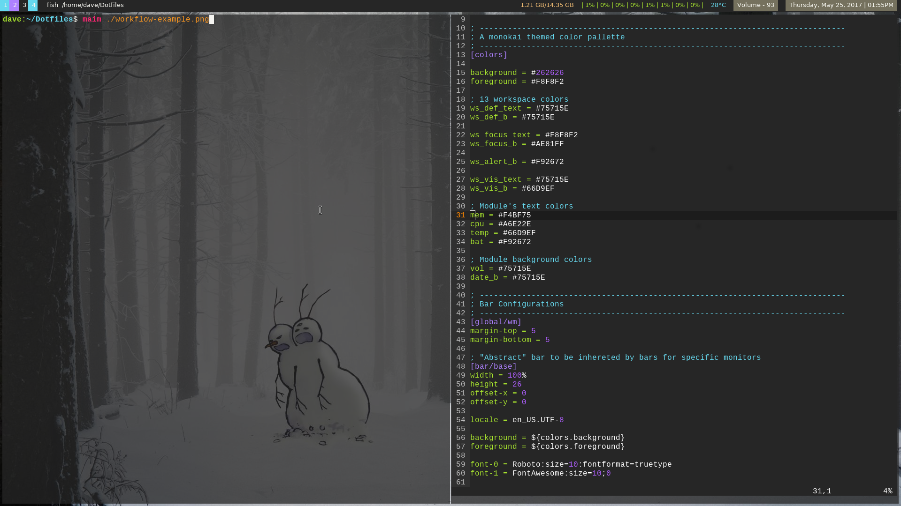
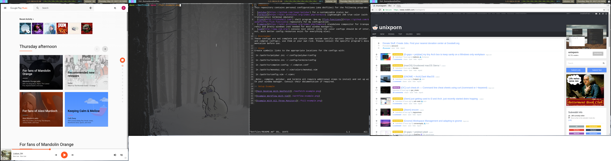

## Contents
This repository contains personal configurations (aka dotfiles) for the following programs:

- [polybar](https://github.com/jaagr/polybar) for a customizable status bar.
- [termite](https://wiki.archlinux.org/index.php/termite) lightweight 256 true color (with transparency) terminal emulator.
- [fish](http://fishshell.com/) shell program. See my [fish-functions](https://github.com/davepfeiffer/fish-functions) repository for my configuration.
- [compton](https://wiki.archlinux.org/index.php/Compton) standalone compositor for transparency and pretty windows (not needed for most window managers).
- [vim](http://www.vim.org/) console text editor (only the color configs should be of interest, much better config resources exist for everything else).

## Disclaimer
These configs are not complete and contain some system specific options (mostly in polybar and compton configs), use them at your own risk. Please consult the specific program's documentation before use.

## Usage
Create symbolic links to the appropriate locations for the configs with:

`ln /path/to/polybar.ini ~/.config/polybar/config`

`ln /path/to/termite.ini ~/.config/termite/config`

`ln /path/to/compton-config ~/.compton.conf`

`ln /path/to/monokai.vim ~/.vim/colors/monokai.vim`

`ln /path/to/config.vim ~/.vimrc`

_Note:_ compton, polybar, and termite all require additional steps to install and set up with your window manager. Consult their documentation if required.

## Setup Example

